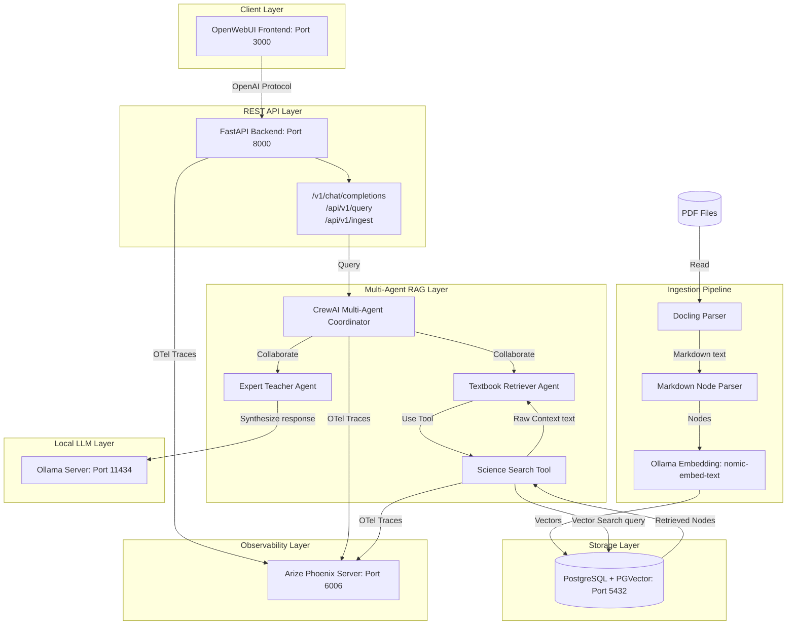
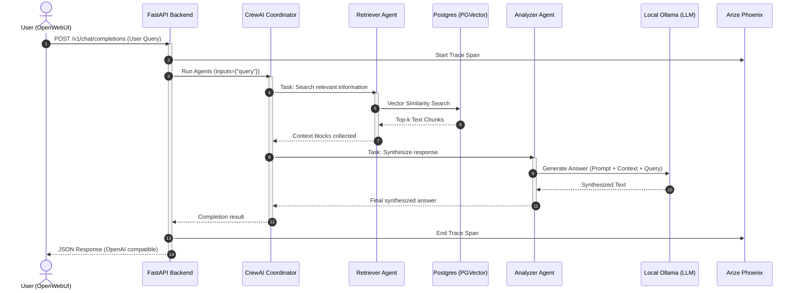

# Solution Architecture and Design Document

This document details the architecture, design choices, and data workflows of the **Document Search Platform**. The platform integrates a contextual Agentic RAG backend with an OpenWebUI frontend, using Postgres with PGVector, LlamaIndex, CrewAI, Docling, Arize Phoenix, and RAGAs.

---

## 1. System Overview

The platform is designed to provide high-quality, traceable search and Q&A overGrade 10 CBSE Science textbooks (Chemistry Chapters 1 to 5). It uses a hybrid approach:
- **Docling** extracts structural content (Markdown headers, lists) from PDFs.
- **LlamaIndex** manages chunking, embedding, indexing, and low-level retrieval.
- **CrewAI** orchestrates a multi-agent system where agents collaborate to retrieve context, cross-verify information, and synthesize the final answer.
- **Arize Phoenix** provides full OpenTelemetry trace visibility.
- **RAGAs** evaluates faithfulness, answer relevance, and context quality.

---

## 2. Solution Architecture

---

## 3. Core Component Design

### 3.1 Document Preprocessing (Docling)
Traditional text extractors discard structural elements (headers, lists, tables). This platform uses **Docling** to parse PDF textbooks. Docling recognizes layout structures and outputs clean Markdown.
- **Why**: Retaining Markdown formatting allows hierarchical splitting, which keeps section headings aligned with the corresponding paragraphs, resulting in highly context-rich vector chunks.

### 3.2 Splitting & Indexing (LlamaIndex & PGVector)
- **Node Parsing**: We use LlamaIndex's `MarkdownNodeParser`. It parses the Markdown generated by Docling, slicing the text along headers (`#`, `##`, `###`). This preserves the document's logical outline.
- **Vector Embeddings**: Text chunks are embedded using the `nomic-embed-text` model running locally inside Ollama.
- **Vector Database**: Chunks and 768-dimensional embeddings are indexed in **PostgreSQL** using the **PGVector** extension. We connect LlamaIndex to PGVector using the `PGVectorStore` connector.

### 3.3 Retrieval Workflow (CrewAI Multi-Agent)
Rather than a direct vector search and LLM completion, the retrieval workflow is designed as a collaborative multi-agent execution:
1. **Science Textbook Retriever Agent**: Receives the query and searches the vector database. It uses the `Science Textbook Search Tool` (which performs a LlamaIndex vector query, retrieves the top 5 chunks, and formats them).
2. **Science Expert Teacher Agent**: Reviews the search results gathered by the Retriever Agent, cross-verifies facts, resolves potential inconsistencies, and drafts the final answer in a clear, educational tone.
3. **Crew Process**: Executed sequentially using the `sequential` process. The tasks are defined externally in `prompts/prompts.yaml`, and prompts can be modified without altering the code.

### 3.4 Inference Tracing (Arize Phoenix)
Observability is implemented using **Arize Phoenix** over **OpenTelemetry**:
- OpenTelemetry environment variables (`OTEL_EXPORTER_OTLP_ENDPOINT="http://localhost:4317"`) direct traces to the Phoenix container.
- Auto-instrumentation is registered for LlamaIndex (`set_global_handler("arize_phoenix")`) and CrewAI/LangChain (`LangChainInstrumentor().instrument()`).
- All LLM queries, tool executions, agent reasoning chains, and database searches are traced.

### 3.5 Evaluation Framework (RAGAs)
Evaluation measures how well the RAG pipeline answers questions over the text:
- We run a pre-defined set of 5 golden questions with ground truths matching the chemistry chapters.
- RAGAs evaluates four metrics:
  - **Faithfulness**: Is the generated answer factually grounded *only* in the retrieved context? (Avoids hallucinations).
  - **Answer Relevance**: Does the generated answer directly address the user's question?
  - **Context Precision**: Were the retrieved items relevant to the question?
  - **Context Recall**: Does the retrieved context cover all the details in the ground truth?

---

## 4. Operational Data Flow

